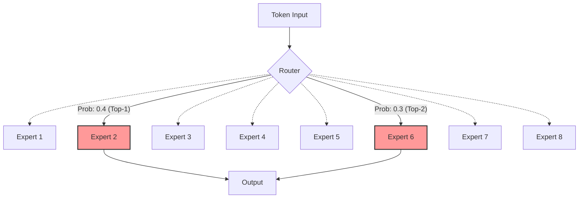
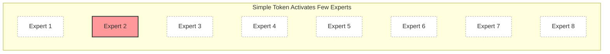
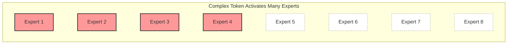
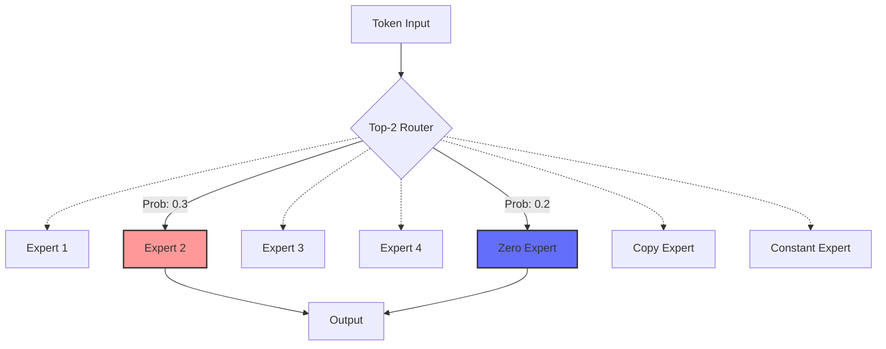

## What is Dynamic Routing and Why is it Important?

Supposing we have 8 cargo vans and we are running a moving company.
The company has a famous regulation: **each time we receive an order, we must assign 2 vans to deliver customers' belongings.**<d-footnote>Similar to Top-2 expert selection out of 8 ones in MoE models, and each order represents a token.</d-footnote>
Ideally, we should assign vans according to the order size.
For example, we can assign 1 van to small orders and more vans to large orders.
However, due to the regulation, we have to assign 2 vans to each order, even if the order is small or large.



In the first case (left) of the above figure, it is a waste of money to use 2 vans for a suitcase and a teddy bear.
In the last case (right), it may consume more time to deliver the order because the vans may need to make more trips to deliver all the belongings.<d-footnote>More trips means more time consumption if no stuff is abandoned due to limited space, similar to disabling token dropping in MoE training. If tokens are dropped, there may induce a performance degradation.<d-cite key="gale2023megablocks"></d-cite></d-footnote>

Normally, customers would like to have their belongings delivered cheaply and quickly. So here comes the questions:
1. **Could we dynamically assign vans according to the order size?**
2. **If we could dynamically assign vans, is it possible to reduce the overall cost and time consumption?**

These are exactly the problems that dynamic routing aims to address in Mixture-of-Experts (MoE) models.
For each token, a conventional router selects top-$k$ experts for computation, where $k$ is a fixed number.
Let's say there are $N_e$ experts in total, the router always selects top-$k$ experts for computation.
The token's original representation is denoted as $\mathbf{x} \in \mathbb{R}^d$.
Then the token's representation after the MoE layer is computed as:

$$
y = \sum_{i=1}^{k} G_i(\mathbf{x}) \cdot E_i(\mathbf{x}),
$$

$$
G(\mathbf{x}) = \text{Top-}k(\text{softmax}(\mathbf{x} \mathbf{W}_g)),
$$

where $G_i(\mathbf{x})$ is the routing probability of the selected $i$-th expert, $E_i(\mathbf{x})$ is the selected $i$-th expert network, and $\mathbf{W}_g \in \mathbb{R}^{d \times N_e}$ is the weight matrix for the router.

Briefly, the router network computes the routing probabilities for all experts, and then the token's representation is computed as the weighted sum of the selected experts:

However, different tokens may have different expert selection preferences.
For example, for complex reasoning tasks, a token may be forwarded to more experts for better performance.
While in simple tasks, a token may be forwarded to fewer experts for better efficiency.

Here, let's transform the above moving company's problems into the MoE context:
1. **Could a router dynamically select the number of experts for each token?**
  - Yes, there are some techniques to dynamically select the number of experts for each token!
2. **Does dynamic routing help improve performance and reduce time consumption?**
  - Yes, dynamic routing could be both effective and efficient!

In this post, we will provide a brief introduction to MoE dynamic routing techniques and their applications in LLMs.
Now let's dive into the details!

## How to Apply Dynamic Routing?

There are three main categories of dynamic routing techniques:
1. **Thresholding**: Instead of selecting top-k experts for each token, the router selects experts based on a threshold.
2. **Dynamic Proposer**: An additional proposer module for predicting the number of activated experts for each token.
3. **Zero-Computation Experts**: Some special experts are regarded as placeholders for routing, but not used for computation.

Here, we will introduce these three categories of dynamic routing techniques in detail.

### Thresholding

Thresholding is the simplest and most straightforward way to apply dynamic routing.
It works by setting a threshold for the probability of the experts.
If the probability is greater than the threshold, the expert is activated.
Otherwise, the expert is deactivated.

**Cumulative Thresholding:** Huang et al. (2024)<d-cite key="huang2024topp"></d-cite> proposes MoE-Dynamic, which is a thresholding-based dynamic routing technique to select the top-p experts for each token.
As the figure below shows, MoE-Dynamic sorts the routing probabilities of experts in descending order, and then selects experts by setting a threshold for the cumulative probability of experts.
When the cumulative probability is greater than the threshold, the experts are activated.

  <iframe src="{{ 'assets/html/2026-04-27-dynamic-routing/top-p.html' | relative_url }}" frameborder='0' scrolling='no' height="600px" width="100%"></iframe>

However, the routing distribution may tend to be uniform if the model is trained from scratch without any regularization because the model tends to activate more experts to obtain a better performance.
To address this issue, the authors propose a regularization loss (probability entropy loss) on the routing probabilities $P$ to encourage a sharper distribution:

$$
\mathcal{L}_{\text{reg}} = -\sum_{i=1}^{N_e} P_i \log P_i
$$

From the experimental results, MoE-Dynamic shows its effectiveness to:
1. achieve better performance than vanilla MoE (~1.68% improvements)
2. accelerate the model training and inference throughput by 5% compared to vanilla MoE
3. show different number of activated experts for different tasks

**Trainable Thresholding:** Different from cumulative thresholding, DynMoE<d-cite key="guo2025dynmoe"></d-cite> proposes a top-any gating function with gating parameters $\mathbf{W}_g \in \mathbb{R}^{d \times N_e}$ and trainable thresholds $\theta \in \mathbb{R}^{N_e}$.
To determine if an expert should be activated, DynMoE first computes the cosine similarity between the token's representation $\mathbf{x}$ and the router $\mathbf{W}_g$, then applies a sigmoid function $\sigma(\cdot)$ to normalize $s$ to [0, 1].
After that, it compares the normalized similarity $s$ with the trainable thresholds $\mathbf{\theta}$ to determine if the expert should be activated.

$$
s(\mathbf{x}) = \frac{\langle \mathbf{x}, \mathbf{W}_g \rangle}{\|\mathbf{x}\| \|\mathbf{W}_g\|},
$$

$$
G(\mathbf{x}) = \text{sign}\left(\sigma\left(s(\mathbf{x})\right) - \sigma\left(\mathbf{\theta}\right)\right),
$$

where the number of activated experts is $\sum_{i=1}^{N_e} G_i(\mathbf{x})$.

As the figure below shows, DynMoE can dynamically select the number of activated experts by setting different thresholds for different experts.

  <iframe src="{{ 'assets/html/2026-04-27-dynamic-routing/sigmoid-threshold.html' | relative_url }}" frameborder='0' scrolling='no' height="600px" width="100%"></iframe>

To enable diverse routing and suppress uniform routing, DynMoE also introduces a regularization loss term, including a diverse loss to lower the similarities within routers and a simplicity loss to maintain numerical stability.

$$
\mathcal{L}_{\text{reg}} = \underbrace{\left\|\mathbf{W}_g^T \mathbf{W}_g - \mathbf{I}_{N_e}\right\|_2}_{\text{diversity loss}} + \underbrace{\frac{1}{N_e} \sum_{i=1}^{N_e} \left\|\mathbf{w}_{g,i}\right\|_2}_{\text{simplicity loss}},
$$

where $\mathbf{I}_{N_e}$ is the identity matrix of size $\mathbb{R}^{N_e \times N_e}$.

The results demonstrate that DynMoE can achieve comparable performance than vanilla MoE with 11% throughput improvements.

**Non-Linear Thresholding:** Wang et al. (2025)<d-cite key="wang2025remoe"></d-cite> proposes ReMoE, which is a non-linear thresholding-based dynamic routing technique to select experts for each token.
Instead of setting a threshold as a hyper-parameter, ReMoE finds activated experts by replacing the Top-$k$ softmax with a ReLU activation function.

$$
G(\mathbf{x}) = \text{ReLU}(\mathbf{x} \mathbf{W}_g),
$$

Due to the non-linearity of ReLU, experts with smaller activations would be filtered out, and the number of activated experts is: $\sum_{i=1}^{N_e} \mathbb{1}\{G_i(\mathbf{x}) > 0\}$.
As shown in the figure below, due to the ReLU activation, experts with positive routing logits would be activated.
Besides, the ReLU gate is fully differentiable, which allows a stable training process.

  

    <iframe src="{{ 'assets/html/2026-04-27-dynamic-routing/relu.html' | relative_url }}" frameborder='0' scrolling='no' height="400px" width="100%"></iframe>
  

To constrain the number of expected activated experts, ReMoE introduces a sparsity regularization loss term:

$$
\mathcal{L}_{\text{reg}}(t) = \lambda(t) \cdot \sum_{i=1}^{N_e} G_i(\mathbf{x}),
$$

$$
\lambda(t) = \lambda(t-1) \cdot \alpha^{\text{sign}((1 - N_k/N_e) - S(t))},
$$

$$
S(t) = 1 - \frac{1}{N_l N_e} \sum_{l=1}^{N_l} \sum_{i=1}^{N_e} \mathbb{1}\{G_i^l(\mathbf{x}) > 0\},
$$

where $\lambda(t)$ is an adaptive coefficient at training step $t$, which is initialized with a small value.
$\alpha > 1$ is a hyper parameter to control the update multiplier, and $S(t)$ represents the sparsity of the activated experts at training step $t$.
Here the sparsity is computed over $N_l$ layers.
The whole regularization loss is designed to close the gap between the number of expected activated experts $N_k$ and the actual number of activated experts.
Therefore, ReMoE does not bring training or inference acceleration, but it can adaptively adjust the number of activated experts on each layer to improve the final performance.

BlockFFN<d-cite key="song2025blockffn"></d-cite> further improves the ReLU activation with an RMS layer normalization to control the magnitude of the activations and stabilize the training process.

$$G(\mathbf{x}) = \text{RMSNorm}(\text{ReLU}(\mathbf{x} \mathbf{W}_g)).$$

BlockFFN also proposes an activation locality loss to encourage similar activation patters in neighboring tokens, and a chunk sparsification loss to maximize the sparsity of a chunk of consecutive tokens.
Based on these settings and specially designed kernels, BlockFFN achieves 3.67x speedup over baseline and shows better commonsense reasoning ability compared to ReMoE especially on larger models.

### Dynamic Proposer

Intuitively, dynamic routing aims to change the value of $k$ for each token.
Besides the above thresholding-based ideas, can we directly predict the value of $k$?
The answer is YES, and that is exactly the idea of dynamic proposer.
Dynamic proposers take the token's representation as input and output the number of activated experts as a prediction.

Ada-K<d-cite key="yue2025adak"></d-cite> applies an additional linear projection to the token's representation to obtain a probability distribution and then samples the activated expert number $k$ from the distribution.

$$
P(\mathbf{x}) = \text{softmax}(\mathbf{x} \mathbf{W}_p),
$$

$$
k \sim P(\mathbf{x}),
$$

where $\mathbf{W}_p \in \mathbb{R}^{d \times N_e}$ is a trainable parameter.

  

    <iframe src="{{ 'assets/html/2026-04-27-dynamic-routing/adak_sampling.html' | relative_url }}" frameborder='0' scrolling='no' height="500px" width="100%"></iframe>
  

Because such a sampling process is not differentiable, Ada-K updates $\mathbf{W}_p$ with the Proximal Policy Optimization (PPO) algorithm<d-cite key="schulman2017ppo"></d-cite>, and take the log likelihood of language modeling as the reward:

$$
r = \log P(x_t | x_1, \dots, x_{t-1}),
$$

where $x_t$ is the expected token to be generated.

The sampling process is useful for the training process since it brings stochasticity to explore different efficiency-performance trade-offs and compute policy gradients for PPO.
During inference, Ada-K simply selects $k$ with the highest probability as the activated expert number.

For pre-trained language models, Ada-K is efficient since it only updates the linear projection matrix $\mathbf{W}_p$ and keeps all other parameters frozen.
For example, when applying Ada-K on Qwen1.5-MoE-14.3B-A2.7B<d-footnote>https://huggingface.co/Qwen/Qwen1.5-MoE-A2.7B</d-footnote>, it takes 1.58h to fine-tune 2.95M parameters, and Ada-K could bring 1.22x speedup over the baseline.

### Zero-Computation Experts

Zero-Computation Experts constitute an efficient sparse-expert mechanism within dynamic routing.
The basic idea is to incorporate a subset of experts that perform no actual computations during the forward pass.
By maintaining a fixed number of activated experts, the selection of these zero-computation experts introduces neither additional FLOPs nor memory overhead, thereby effectively reducing the computational cost.
This design improves efficiency without compromising model capacity, and it further enables flexible, adaptive resource allocation when combined with dynamic routing.

**Null Experts:** Zeng et al. (2024)<d-cite key="zeng2024adamoe"></d-cite> propose AdaMoE, in which zero-computation experts are defined as performing no operations and consuming zero FLOPs.
Building on the original top-$k$ MoE, the router still selects a fixed number of experts, but some of these may be zero-computation null experts.
When a token is routed to a null expert, it is dropped out and no forward computation is performed, no additional FLOPs are incurred, and no activation memory is consumed, allowing the number of real experts per token to adapt dynamically.

  

    <iframe src="{{ 'assets/html/2026-04-27-dynamic-routing/adamoe.html' | relative_url }}" frameborder='0' scrolling='no' height="600px" width="100%"></iframe>
  

Following the introduction of zero-computation experts, the lack of a load-balancing mechanism may lead the router to over-select real experts, resulting in an uneven workload distribution and undermining the intended FLOPs reduction. To mitigate this, AdaMoE incorporates an average-load strategy for null experts within the load-balancing loss:

$$
\mathcal{L}_{\text{balance}} = (N_e + N_z) \sum_{i=1}^{N_e + N_z} \tilde{f}_i \cdot P_i,
$$

$$
\tilde{f}_i = 
\begin{cases} 
f_i & \text{if } i \leq N_e \\
\frac{1}{N_z} \sum_{j=N_e+1}^{N_e+N_z} f_j & \text{if } i > N_e 
\end{cases},
$$

where $N_z$ denotes the number of null experts, $f_i$ denotes the load of the $i$-th expert and $P_i$ denotes the routing probability of the $i$-th expert.
The modified load-balancing loss in AdaMoE accounts for null experts to control the average load of real experts, while avoiding unnecessary constraints among identical zero-computation experts, thus giving the router greater flexibility to optimize token-to-expert allocation.

From the experimental results, AdaMoE demonstrates that it achieves higher average accuracy across multiple benchmarks while reducing FLOPs by an average of 15.21% during inference.

**Zero, Copy, and Constant Experts:** Jin et al. (2025)<d-cite key="jin2025moepp"></d-cite> propose MoE++, a heterogeneous MoE framework designed to improve both efficiency and effectiveness. It introduces three types of zero-computation experts: Zero, Copy, and Constant experts, which replace a subset of real experts to reduce computational cost without altering expert counts or model capacity:

- Zero Experts: output a zero vector, requiring no computation: $E_i(\mathbf{x}) = \mathbf{0}$
- Copy Experts: reuse the input token representation directly: $E_i(\mathbf{x}) = \mathbf{x}$
- Constant Experts: output a learned constant vector independent of input: $E_i(\mathbf{x}) = \alpha_1 \mathbf{x} + \alpha_2 \mathbf{v}$, where $[\alpha_1, \alpha_2] = \text{softmax}(\mathbf{x} \mathbf{W}_c)$. $\mathbf{W}_c \in \mathbb{R}^{d \times 2}$ and $\mathbf{v} \in \mathbb{R}^d$ are trainable parameters.

These experts incur negligible computation, communication, and memory overhead.
When these zero-computation experts are selected, they effectively skip real expert computation while maintaining the top-k selection budget and sparsity patterns.

To address potential issues such as unstable routing or over-selection of low-computation experts, MoE++ introduces a Heterogeneous Load Balance Loss, controlled by a hyperparameter $\tau$ which regulates the allocation of tokens between zero-computation and FFN experts, promoting a balanced computational load across the expert ensemble.

$$
\mathcal{L}_{\text{balance}} = \sum_{i=1}^{N_e + N_z} \eta_i f_i P_i, \quad \eta_i = 
\begin{cases} 
1, & \text{if Expert } i \text{ is an FFN expert}, \\
\tau, & \text{if Expert } i \text{ is a zero-computation expert}.
\end{cases}
$$

The experimental results show that MoE++ consistently outperforms same-scale Vanilla MoE across downstream tasks, improves expert throughput by 15%, and achieves performance comparable to dense models with 2–3x more parameters under limited training budgets.

## Challenges

Dynamic routing techniques have been utilized to various MoE models.
For example, Meituan LongCat Team has scaled Copy Expert (one of the zero-computation experts) MoE model to 560B parameters<d-cite key="meituan2025longcat"></d-cite>, and Uni-MoE-2.0-Omni employs thresholding-based dynamic routing to build multi-modal MoE.<d-cite key="li2025uni-moe-2.0-omni"></d-cite>

However, there are still some challenges to be addressed for dynamic routing:

- **Performance-Efficiency Tradeoff:** Although some dynamic routing techniques can achieve better performance together with efficiency, the performance and efficiency are still a tradeoff. For example, DynMoE brings 11% throughput improvements over vanilla MoE, but the performance is slightly lower. This is because the performance and efficiency are not always aligned. If we want to achieve extreme sparsity, the number of activated experts would be very small, which may lead to performance degradation.
- **Efficient Implementations:** For heterogeneous zero-computation experts or special thresholding-based dynamic routing, current grouped GEMM kernels may not be directly applicable, and specialized implementations are needed. For example, BlockFFN designs kernels for ReLU activation and chunk-level sparsification, which significantly accelerates the model throughput.
- **Sparsity Controlling:** If no sparsity regularization is applied, the number of activated experts tends to be very high due to the performance optimization objective. Therefore, most dynamic routing techniques apply sparsity regularization to control the number of activated experts.
- **Expert Load Balancing:** For MoE with zero-computation experts, models may tend to select regular experts, which may lead to uneven workload distribution and undermining the intended FLOPs reduction. To address this, dynamic routing should incorporate an load balancing strategy for both regular and zero-computation experts.

## Conclusion

In this post, we provide a brief introduction to MoE dynamic routing techniques and review several key methods, including thresholding, dynamic proposer, and zero-computation experts.
Dynamic routing offers a promising direction for MoE models by breaking the rigidity of fixed top-k routing and enabling adaptive expert allocation for each token.
While challenges such as performance-efficiency tradeoff, efficient implementations, sparsity controlling, and expert load balancing still exist, dynamic routing has shown great potential in improving the performance and efficiency of MoE models, and has been applied to existing large language models.
As MoE models continue to evolve, we expect dynamic routing to play an increasingly important role in future large-scale foundation models.

🚚 After reading this blog, if you are planning to start a moving company, you may think of dynamic routing for your business! :)
