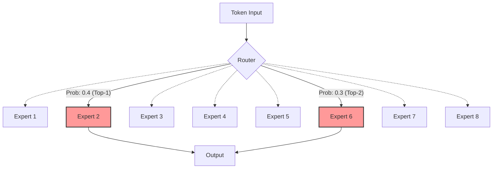
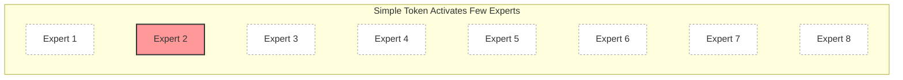
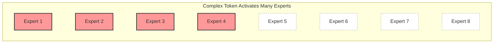

## What is Dynamic Routing and Why is it Important?

Supposing we have 8 cargo vans and we are running a moving company.
The company has a famous regulation: **each time we receive an order, we must assign 2 vans to deliver customers' belongings.**<d-footnote>Similar to Top-2 expert selection out of 8 ones in MoE models, and each order represents a token.</d-footnote>
Ideally, we should assign vans according to the order size.
For example, we can assign 1 van to small orders and more vans to large orders.
However, due to the regulation, we have to assign 2 vans to each order, even if the order is small or large.



In the first case (left) of the above figure, it is a waste of money to use 2 vans for a suitcase and a teddy bear.
In the last case (right), it may consume more time to deliver the order because the vans may need to make more trips to deliver all the belongings.<d-footnote>More trips means more time consumption if no stuff is abandoned due to limited space, similar to disabling token dropping in MoE training. If tokens are dropped, there may induce a performance degradation.<d-cite key="gale2023megablocks"></d-cite></d-footnote>

Normally, customers would like to have their belongings delivered cheaply and quickly. So here comes the questions:
1. **Could we dynamically assign vans according to the order size?**
2. **If we could dynamically assign vans, is it possible to reduce the overall cost and time consumption?**

These are exactly the problems that dynamic routing aims to address in Mixture-of-Experts (MoE) models.
For each token, a conventional router selects top-$k$ experts for computation, where $k$ is a fixed number.
Let's say there are $N_e$ experts in total, the router always selects top-$k$ experts for computation.
The token's original representation is denoted as $\mathbf{x} \in \mathbb{R}^d$.
Then the token's representation after the MoE layer is computed as:

$$
y = \sum_{i=1}^{k} G_i(\mathbf{x}) \cdot E_i(\mathbf{x}),
$$

$$
G(\mathbf{x}) = \text{Top-}k(\text{softmax}(\mathbf{x} \mathbf{W}_g)),
$$

where $G_i(\mathbf{x})$ is the routing probability of the selected $i$-th expert, $E_i(\mathbf{x})$ is the selected $i$-th expert network, and $\mathbf{W}_g \in \mathbb{R}^{d \times N_e}$ is the weight matrix for the router.

Briefly, the router network computes the routing probabilities for all experts, and then the token's representation is computed as the weighted sum of the selected experts:

However, different tokens may have different expert selection preferences.
For example, for complex reasoning tasks, a token may be forwarded to more experts for better performance.
While in simple tasks, a token may be forwarded to fewer experts for better efficiency.

Here, let's transform the above moving company's problems into the MoE context:
1. **Could a router dynamically select the number of experts for each token?**
  - Yes, there are some techniques to dynamically select the number of experts for each token!
2. **Does dynamic routing help improve performance and reduce time consumption?**
  - Yes, dynamic routing could be both effective and efficient!

In this post, we will provide a brief introduction to MoE dynamic routing techniques and their applications in LLMs.
Now let's dive into the details!

## How to Apply Dynamic Routing?

There are three main categories of dynamic routing techniques:
1. **Thresholding**: Instead of selecting top-k experts for each token, the router selects experts based on a threshold.
2. **Dynamic Proposer**: An additional proposer module for predicting the number of activated experts for each token.
3. **Zero-Computational Experts**: Some special experts are regarded as placeholders for routing, but not used for computation.

Here, we will introduce these three categories of dynamic routing techniques in detail.

### Thresholding

Thresholding is the simplest and most straightforward way to apply dynamic routing.
It works by setting a threshold for the probability of the experts.
If the probability is greater than the threshold, the expert is activated.
Otherwise, the expert is deactivated.

**Cumulative Thresholding:** Huang et al. (2024)<d-cite key="huang2024topp"></d-cite> proposes MoE-Dynamic, which is a thresholding-based dynamic routing technique to select the top-p experts for each token.
As the figure below shows, MoE-Dynamic sorts the routing probabilities of experts in descending order, and then selects experts by setting a threshold for the cumulative probability of experts.
When the cumulative probability is greater than the threshold, the experts are activated.

  <iframe src="{{ 'assets/html/2026-04-27-dynamic-routing/top-p.html' | relative_url }}" frameborder='0' scrolling='no' height="600px" width="100%"></iframe>

However, the routing distribution may tend to be uniform if the model is trained from scratch without any regularization because the model tends to activate more experts to obtain a better performance.
To address this issue, the authors propose a regularization loss (probability entropy loss) on the routing probabilities $P$ to encourage a sharper distribution:

$$
\mathcal{L}_{\text{reg}} = -\sum_{i=1}^{N_e} P_i \log P_i
$$

From the experimental results, MoE-Dynamic shows its effectiveness to:
1. achieve better performance than vanilla MoE (~1.68% improvements)
2. accelerate the model training and inference throughput by 5% compared to vanilla MoE
3. show different number of activated experts for different tasks

**Trainable Thresholding:** Different from cumulative thresholding, DynMoE<d-cite key="guo2025dynmoe"></d-cite> proposes a top-any gating function with gating parameters $\mathbf{W}_g \in \mathbb{R}^{d \times N_e}$ and trainable thresholds $\theta \in \mathbb{R}^{N_e}$.
To determine if an expert should be activated, DynMoE first computes the cosine similarity between the token's representation $\mathbf{x}$ and the router $\mathbf{W}_g$, then applies a sigmoid function $\sigma(\cdot)$ to normalize $s$ to [0, 1].
After that, it compares the normalized similarity $s$ with the trainable thresholds $\mathbf{\theta}$ to determine if the expert should be activated.

$$
s(\mathbf{x}) = \frac{\langle \mathbf{x}, \mathbf{W}_g \rangle}{\|\mathbf{x}\| \|\mathbf{W}_g\|},
$$

$$
G(\mathbf{x}) = \text{sign}\left(\sigma\left(s(\mathbf{x})\right) - \sigma\left(\mathbf{\theta}\right)\right),
$$

where the number of activated experts is $\sum_{i=1}^{N_e} G_i(\mathbf{x})$.

As the figure below shows, DynMoE can dynamically select the number of activated experts by setting different thresholds for different experts.

  <iframe src="{{ 'assets/html/2026-04-27-dynamic-routing/sigmoid-threshold.html' | relative_url }}" frameborder='0' scrolling='no' height="600px" width="100%"></iframe>

To enable diverse routing and suppress uniform routing, DynMoE also introduces a regularization loss term, including a diverse loss to lower the similarities within routers and a simplicity loss to maintain numerical stability.

$$
\mathcal{L}_{\text{reg}} = \underbrace{\left\|\mathbf{W}_g^T \mathbf{W}_g - \mathbf{I}_{N_e}\right\|_2}_{\text{diversity loss}} + \underbrace{\frac{1}{N_e} \sum_{i=1}^{N_e} \left\|\mathbf{w}_{g,i}\right\|_2}_{\text{simplicity loss}},
$$

where $\mathbf{I}_{N_e}$ is the identity matrix of size $\mathbb{R}^{N_e \times N_e}$.

The results demonstrate that DynMoE can achieve comparable performance than vanilla MoE with 11% throughput improvements.

**Non-Linear Thresholding:**

Should we put these into thresholding? ReMoE<d-cite key="wang2025remoe"></d-cite>, BlockFFN<d-cite key="song2025blockffn"></d-cite>

### Dynamic Proposer

Ada-K<d-cite key="yue2025adak"></d-cite>

DES<d-cite key="han2025des"></d-cite>

### Zero-Computational Experts

AdaMoE<d-cite key="zeng2024adamoe"></d-cite>

MoE++<d-cite key="jin2025moepp"></d-cite>

LongCat-Flash<d-cite key="meituan2025longcat"></d-cite>

<!-- 
## Applications

- LongCat-Flash<d-cite key="meituan2025longcat"></d-cite>
- UniMoE-2.0<d-cite key="li2025uni-moe-2.0-omni"></d-cite>
- BlockFFN<d-cite key="song2025blockffn"></d-cite> -->

## Challenges

- Performance-Efficiency Tradeoff
- Efficient Implementations: infra, kernel, frameworks
- Expert Load Balancing
- Sparsity controlling

## Conclusion

